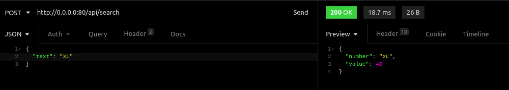

# Api Números Romanos
# Documentação Api

 ##  Como abrir o código em seu computador!

Baixe o arquivo zip e o descompacte, depois o abra em seu editor de código de preferência.

## Quais são as classes relacionadas a Api e suas respectivas funcionalidades:

### api.php

    É onde está localizada a montagem da rota para efetuar a requisição.
### ApiController

    Está é a classe controladora de nossa Api, ela verifica a validação de nossa requisição e nos retorno a resposta com o status da requisição e um *JSON*.

### ApiRequest

    Está é a classe responsável por fazer as verificações de validação da requisição enviada.

### IsRomanNumeral

    Está é a classe onde fica localizada a nossa regra de validação da requisição.

### RomanNumerals

    Está classe é um enum responsável por passar os 7 algarismos romanos e seus respectivos valores inteiros.

### ConvertToIntegerRepository

    Está classe é a responsável por possuir nossa regra de negócio, é onde são efetuadas as devidas transformações de nossos alagarismos romanos em números inteiros.

### ApiTest

    Está é a classe responsável por executar nossos testes na rota e suas respectivas respostas.

# Como Utilizar a Api

Na pasta do projeto, em seu terminal execute o seguinte comando:
```./vendor/bin/sail up```

Após executar o comando abra o *Insomnia* ou o *Postman* e execute os próximos passos:

* Execute uma request *POST*  no endpoint:  ```http://0.0.0.0:80/api/search```
  
  

* No **Body** de sua requisição passe um *JSON* com o nome do campo como **text** e o valor passado deve ser um número romano válido, siga o exemplo do *JSON* abaixo:
  ```
  {
	"text": "XL"
  }
  ```

  

* No **Header** de sua requisição passe estes dois campos, com seus respectivos valores:
  ```
    Accept: application/json
    Content-Type: application/json
  ```

  

* Depois de seguir os passos acima, você receberá **200OK** e o *JSON* abaixo com a resposta de sua requisição:
  ```
  {
    "number": "XL",
    "value": 40
  }
  ```

  

# Casos de erro da requisição

 * Primeiro caso, se você não passar um número romano ou não passar a key **text** o retorno de erro será **422 Unprocessable Content** com *JSON* contendo a mensagem de erro, como os exemplos abaixo:

    
    

 * Segundo caso, se você se esquecer de passar os campos do **Header** o retorno de erro será **404 Not Found**, como os exemplos abaixo:

    
    

# Como testar a Api

* Para testar a api, você deverá estar com o *sail* rodando para isso execute o seguinte comando:

    ```./vendor/bin/sail up```

* Logo após execute o seguinte comando:

    ```./vendor/bin/sail test```

* Ele executará os testes que o arquivo possui o nome de **ApiTest** e retorná a seguinte resposta:

    
    
